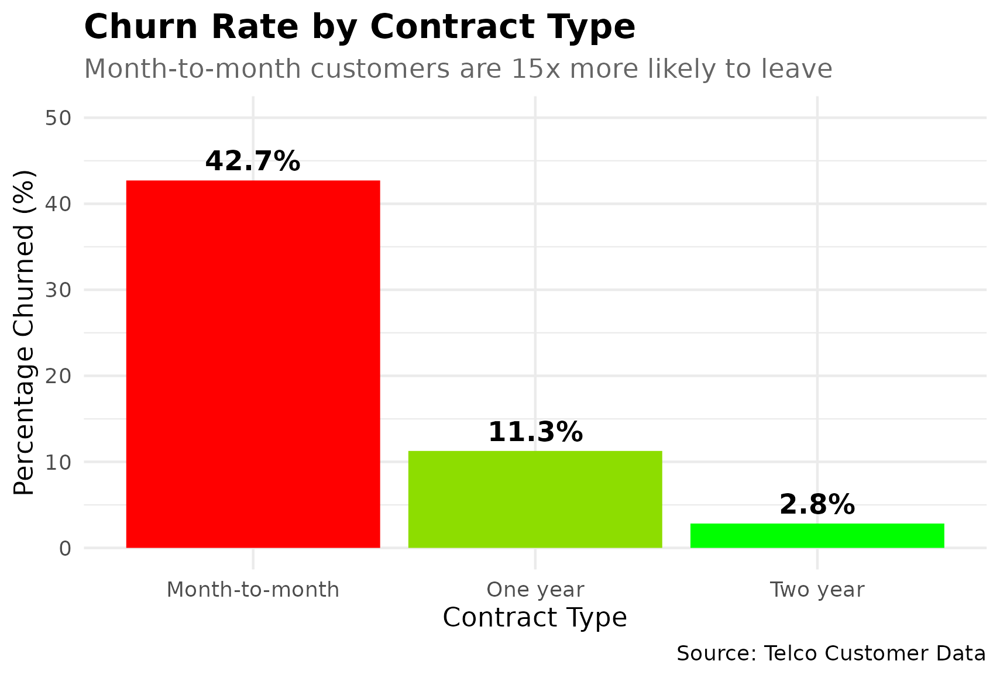

# telco-customer-churn-analysis

## Project Overview
End-to-end analysis identifying key drivers of customer churn and prediciting customers at risk using R.

## Key Findings
- Discovered 1,307 customers in "perfect storm" risk category.
- identified $113,948 montly revenue at risk.
- Three major churn drivers: Contract type, Payment method, Internet service.
- Built a logistic regressive model with strong predictive model.

## Technical Skills Demonstrated
- Data cleaning & preprocessing
- Exploritory Data Analysis (EDA)
- Stastical testing (Chi-squared, Cramer's V)
- Predicitve Modeling (Logistic regression)
- Data visulization (ggplot2)
- Business impact analysis

## Results

